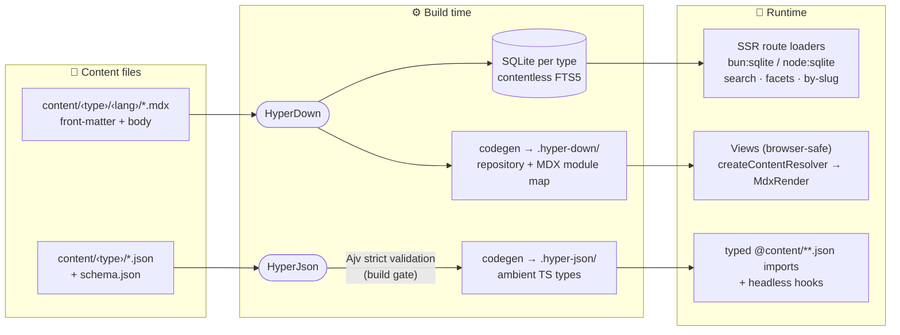

# Virtus — Local Headless CMS Toolkit

<p align="center">
  
</p>

<p align="center">
  <em>Turn a folder of content files into a typed, searchable content layer —<br/>
  no database service, no API, no CMS server.</em>
</p>

<p align="center">
  <a href="https://github.com/ZauJulio/virtus/actions/workflows/release.yml"></a>
  <a href="https://www.npmjs.com/package/@virtus/hyper-down"></a>
  <a href="https://www.npmjs.com/package/@virtus/hyper-json"></a>
  <a href="https://www.npmjs.com/package/create-virtus-app"></a>
  <a href="./LICENSE"></a>
</p>

<p align="center">
  
  
  
  
  
  
</p>

---

## Summary

- [What is Virtus?](#what-is-virtus)
- [Packages](#packages)
- [Quick start](#quick-start)
  - [Option A — scaffold a new app](#option-a--scaffold-a-new-app)
  - [Option B — add an engine to an existing Vite app](#option-b--add-an-engine-to-an-existing-vite-app)
- [Architecture](#architecture)
- [Repository structure](#repository-structure)
- [What a consuming app looks like](#what-a-consuming-app-looks-like)
- [Configuration](#configuration)
- [CLIs & MCP servers](#clis--mcp-servers)
- [Contributing / Development](#contributing--development)
- [Releases](#releases)
- [License](#license)

---

## What is Virtus?

**Virtus is a monorepo of npm packages** — two independent, zero-backend content engines
and a scaffolder:

- **HyperDown** handles _prose_: Markdown/MDX files with front-matter become a compact
  SQLite database (full-text search included) queried **only on the server**, while the
  MDX bodies compile to React components.
- **HyperJson** handles _data_: JSON files validated against JSON Schemas at build time,
  with generated TypeScript types so every import is fully typed.
- **create-virtus-app** scaffolds a working app on either of four frameworks, already
  wired to both engines.

Everything ships as static assets next to your app. Each engine exposes a **Vite
plugin**, a **CLI**, and an **MCP server** (AI agents can drive it as tools), and bundles
its JSON Schemas for editor + runtime validation.

## Packages

| Package                                      | npm                                                                      | One-liner                                                                              | Docs                                     |
| -------------------------------------------- | ------------------------------------------------------------------------ | -------------------------------------------------------------------------------------- | ---------------------------------------- |
| [`packages/HyperDown`](./packages/HyperDown) | [`@virtus/hyper-down`](https://www.npmjs.com/package/@virtus/hyper-down) | Markdown/MDX → SQLite (contentless FTS5) → SSR route loaders + lazy MDX rendering.     | [README](./packages/HyperDown/README.md) |
| [`packages/HyperJson`](./packages/HyperJson) | [`@virtus/hyper-json`](https://www.npmjs.com/package/@virtus/hyper-json) | JSON Schema → strict Ajv validation + generated TS types + typed `.json` imports.      | [README](./packages/HyperJson/README.md) |
| [`packages/scaffold`](./packages/scaffold)   | [`create-virtus-app`](https://www.npmjs.com/package/create-virtus-app)   | `bun create virtus-app` — Vike, React Router v7, TanStack Start, or Next.js templates. | [README](./packages/scaffold/README.md)  |
| [`packages/configs`](./packages/configs)     | — (internal)                                                             | Shared tsconfig / oxlint / oxfmt / Tailwind / Vite presets for this repo.              | —                                        |

> **The two engines are independent** — neither depends on the other; adopt one or both.
> The reference consumer is the [portifolio](https://github.com/ZauJulio/portifolio) app,
> live at [zaujulio.vercel.app](https://zaujulio.vercel.app).

## Quick start

### Option A — scaffold a new app

```bash
bun create virtus-app my-app          # interactive picker
bunx create-virtus-app my-app --vike  # non-interactive (--react-router | --tanstack | --next)

cd my-app && bun install && bun run dev
```

Every template ships the same routes (`/articles` with live full-text search,
`/articles/:slug`, `/cooking[/:slug]`, `/projects`, `/pt/*`) and the same Playwright
suite. Generated reference apps live in [`examples/`](./examples).

### Option B — add an engine to an existing Vite app

**HyperDown** (Markdown/MDX + search):

```bash
bun add @virtus/hyper-down
bunx hyperdown init both        # hyperdown.config.json + frontmatter schema
bunx hyperdown create-frontmatter --name article --locales "en,pt-BR"
bunx hyperdown create-item --type article --slug hello-world --lang en
```

```ts
// vite.config.ts — order matters: MDX plugin BEFORE the framework plugins
import { hyperdownMdxPlugin, hyperdownPlugin } from "@virtus/hyper-down/plugins";

export default defineConfig({
  plugins: [hyperdownMdxPlugin(), /* vike()/react()/… */ hyperdownPlugin()],
  ssr: { external: ["bun:sqlite", "node:sqlite"], noExternal: ["@virtus/hyper-down"] },
});
```

Query in a server loader via the generated repository, render in the view with the
browser-safe resolver — full walkthrough in the
[HyperDown README](./packages/HyperDown/README.md).

**HyperJson** (typed JSON):

```bash
bun add @virtus/hyper-json
bunx hyperjson init
bunx hyperjson create-content-type --name projects --fields "id:string:required;name:string:required;url:string"
bunx hyperjson generate
```

```ts
import projects from "@content/projects/en/projects.json"; // fully typed
```

Details (plugin, hooks, wrapper property): [HyperJson README](./packages/HyperJson/README.md).

## Architecture



- **Prose path (HyperDown)**: front-matter becomes a searchable SQLite index queried only
  on the server; the MDX body never touches the database — it compiles to a lazy React
  component resolved in the view.
- **Data path (HyperJson)**: every JSON file must pass schema validation to build, and
  every import of it is typed.

### HyperDown — Markdown/MDX engine

**Build time** (Vite plugin on `buildStart`, `hyperdown gen:db`, or the Next.js adapter):

1. **Codegen** writes idempotently into the app's `.hyper-down/` tree: an ambient
   `<Type>Meta` interface, a **lazy `<type>Repository` proxy** (server-only DAO), and a
   **static eager `import.meta.glob`** map of MDX bodies (`contentModules`).
2. **Writer** parses front-matter (parallel read/parse/validate pool → serial
   single-transaction persist) and emits one `.db` per content type: metadata table,
   indexed `<type>_tags` bridge for array facets, and a **contentless FTS5** table — the
   index covers the front-matter columns **plus the body text**, tokenized into the
   inverted index but **never stored**.
3. On `closeBundle` every `.db` is copied into `dist/metadata/` (self-contained deploys).

**Runtime** — strictly split:

- **Server (route loaders)**: `ContentRepository<T>` — `search()` (FTS5 `MATCH` across all
  locales mapped back to one row per slug; filters; sort; pagination), `distinctValues()`
  (facets), `getMetaBySlug()` (locale fallback). Read-only `bun:sqlite`, or `node:sqlite`
  on Node ≥ 22 (e.g. Vercel). Exported only from `@virtus/hyper-down/server`.
- **Client (views)**: `createContentResolver(contentModules[type])` →
  `getContent(slug, lang)` resolves the lazy MDX component; rendered with `MdxRender`.
  No database code ever reaches the browser bundle.

**Plugins / adapters**: `hyperdownMdxPlugin` (wraps `@mdx-js/rollup`, intercepts
`*.mdx?raw`; register before the framework plugins) · `hyperdownSitemapPlugin` ·
`withHyperDown` / `runHyperDownNextCodegen` (`@virtus/hyper-down/next`) ·
`@virtus/hyper-down/drizzle` (optional Drizzle proxy).

### HyperJson — typed JSON engine

1. **Validation**: Ajv (+ formats), `strict` by default — every `.json` checked against
   its sibling `schema.json` at build time; failures exit non-zero.
2. **Codegen**: in-process `json-schema-to-typescript` through a bounded parallel pool
   (`HYPERJSON_CONCURRENCY`); emits ambient `declare module` types + a `generated.d.ts`
   barrel into the app's `.hyper-json/`.
3. **Hooks**: pure in-memory React hooks — `useFilter`, `useSort`, `useSearch`,
   `usePaginate`, `useComposed`.

### create-virtus-app — scaffolder

Overlays `templates/_shared/` (content, e2e suite, configs) with `templates/<id>/`
(framework code), applying token replacement. Same routes + same Playwright specs in all
four frameworks; the harness (`bun run test:templates`) packs the engines as tarballs and
runs build + typecheck + unit + e2e per template.

## Repository structure

```text
virtus/
├── packages/
│   ├── HyperDown/            @virtus/hyper-down
│   │   ├── src/
│   │   │   ├── frontmatter/  parser · validator · writer · codegen · SQL schema
│   │   │   ├── db/           ContentRepository · lazy proxy · SSR SQLite client
│   │   │   ├── components/   MdxRender · default MDX component maps · Mermaid
│   │   │   ├── hooks/        createContentResolver (browser-safe)
│   │   │   ├── plugins/      hyperdownPlugin · mdx · sitemap · next adapter
│   │   │   └── drizzle/      optional drizzle-orm re-exports
│   │   ├── cli/              `hyperdown` (commander + @clack/prompts)
│   │   ├── mcp/              `hyperdown-mcp` (stdio MCP server)
│   │   ├── schemas/          bundled JSON Schemas (config + FrontMatter CMS)
│   │   └── .agents/          rules + skills for AI agents
│   ├── HyperJson/            @virtus/hyper-json
│   │   ├── src/              codegen · lib (config/validate) · hooks · plugins
│   │   └── cli/  mcp/  schemas/  .agents/
│   ├── scaffold/             create-virtus-app
│   │   ├── src/              CLI · template registry · scaffold engine
│   │   ├── templates/        _shared + vike + react-router + tanstack + next
│   │   └── scripts/          test-templates harness · gen-examples
│   └── configs/              shared tsconfig / oxlint / oxfmt / tailwind presets
├── examples/                 generated reference apps (one per template)
└── .github/workflows/        release.yml — npm publish + tag/release on push to main
```

## What a consuming app looks like

```text
my-app/
├── content/
│   ├── article/              HyperDown collection (Markdown/MDX)
│   │   ├── en/hello.mdx      locale folders; slug = filename
│   │   └── pt-BR/ola.mdx
│   └── projects/             HyperJson collection (JSON)
│       ├── schema.json       JSON Schema — drives validation + generated types
│       └── en/projects.json
├── .hyper-down/              generated — types/builder/modules per type (do not edit)
├── .hyper-json/              generated — ambient types (do not edit)
├── frontmatter.json          content-type definitions (FrontMatter CMS format)
├── hyperdown.config.json     HyperDown config (contentDir, sitemap, i18n)
├── hyperjson.config.json     HyperJson config (contentDir, validation)
└── vite.config.ts            hyperdownMdxPlugin → framework → hyperdownPlugin → …
```

## Configuration

### `hyperdown.config.json`

```jsonc
{
  "$schema": "./node_modules/@virtus/hyper-down/schemas/hyperdown.config.schema.json",
  "database": {
    "contentDir": "./content", // where .mdx lives; also the .hyper-down/ output root
    "frontmatterJsonPath": "frontmatter.json", // relative to THIS config file
  },
  "sitemap": {
    "siteUrl": "https://example.com",
    "outputPath": "./public/sitemap.xml",
    "staticRoutes": [{ "path": "/", "priority": "1.0", "changefreq": "weekly" }],
    "contentTypes": [{ "name": "article", "basePath": "/articles", "priority": "0.7" }],
  },
  "i18n": { "defaultLocale": "en", "locales": ["en", "pt-BR"] },
}
```

### `frontmatter.json` (FrontMatter CMS format)

- `frontMatter.content.pageFolders[]` — `{ title, path, contentTypes, defaultLocale,
locales }`. The first `contentTypes` entry names the SQLite table and the
  `content/<name>/` folder.
- `frontMatter.taxonomy.contentTypes[]` — `{ name, fields: [{ name, type, required }] }`.
  Storage mapping: `draft` → INTEGER (no FTS) · `datetime` → TEXT (no FTS) ·
  `tags`/`categories` → TEXT JSON array (flattened into FTS + tags bridge) · everything
  else → TEXT (FTS-indexed).

### `hyperjson.config.json`

```jsonc
{
  "$schema": "./node_modules/@virtus/hyper-json/schemas/hyperjson.config.schema.json",
  "contentDir": "content", // the only required field
  "validation": { "strict": true, "failOnError": true },
}
```

All three are scaffolded by the CLIs (`hyperdown init both`, `hyperjson init`) and
validated against the schemas bundled with each package.

## CLIs & MCP servers

```bash
hyperdown init|validate|update|gen:db|create-content|create-frontmatter|create-item
hyperjson init|validate|generate|create-content-type
```

- **`hyperdown-mcp`** (stdio) — `hyperdown_init` · `hyperdown_validate` · `hyperdown_update` ·
  `hyperdown_gen_db` · `hyperdown_create_content` · `hyperdown_create_frontmatter` ·
  `hyperdown_create_item`
- **`hyperjson-mcp`** (stdio) — `hyperjson_init` · `hyperjson_validate` · `hyperjson_generate` ·
  `hyperjson_create_content_type`

Creation tools require their full flag set — interactive prompts are disabled under MCP.
Each package also ships a `.agents/` tree (rules + skills) for agents working in a repo
that installs it.

## Contributing / Development

> Requires **Bun** (the package manager is pinned to `bun@1.3.5`).

```bash
bun install

bun run build            # turbo run build (all packages, tsdown)
bun run typecheck        # turbo run typecheck
bun run test             # turbo run test (bun test in each package)
bun run check            # oxlint + oxfmt across the repo
bun run test:templates   # full scaffold harness: 4 templates × (build + typecheck + unit + e2e)
bun run gen:examples     # regenerate examples/<id>/ from the templates
```

Conventions:

- **OXC** tooling (`oxlint` + `oxfmt`) — not ESLint, Prettier, or Biome.
- Library builds via [tsdown](https://tsdown.dev/) (Rolldown-powered).
- Pre-commit runs lint-staged; pre-push runs typecheck + build (husky).
- After changing any file in a package's `schemas/`, run its `bun run gen:types`.
- Agent-facing docs live in [`AGENTS.md`](./AGENTS.md), [`CLAUDE.md`](./CLAUDE.md), and
  each engine's `.agents/` tree.

## Releases

Pushing to `main` runs [`release.yml`](./.github/workflows/release.yml): for each engine
whose `package.json` version is not on the npm registry yet, it builds, publishes
(`npm publish --access public`), and creates the matching tag + GitHub Release
(`hyper-down-vX.Y.Z` / `hyper-json-vX.Y.Z`). **To release: bump the version, push to
`main`.** Reruns are safe — already-published versions are skipped.

## License

[MIT](./LICENSE) © Zaú Júlio
