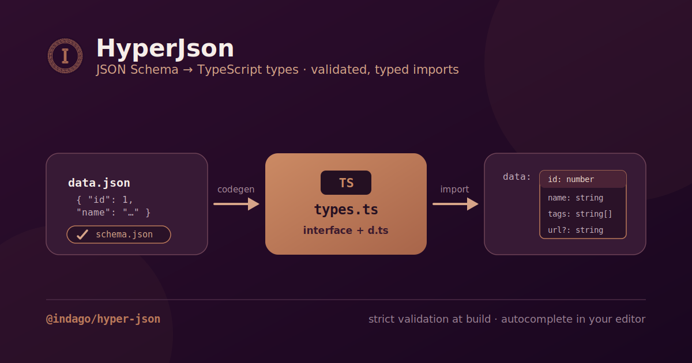

# HyperJson

<p align="center">
  
</p>

<p align="center">
  <strong>JSON Schema → strict validation + auto-generated TypeScript types</strong><br/>
  <em>plus ambient module declarations for fully-typed JSON content imports.</em>
</p>

<p align="center">
  <a href="https://www.npmjs.com/package/@indago/hyper-json"></a>
  
  
  
  
</p>

---

## What is HyperJson?

HyperJson is the structured-data counterpart to [HyperDown](../HyperDown). Where HyperDown
handles Markdown/MDX prose, HyperJson handles **JSON content** — playlists, photo albums,
profiles, skills, project lists, and any other collection that is better described as data
than as documents.

It does three things:

1. **Validates** every JSON content file against the `schema.json` that sits next to it,
   at build time, using [Ajv](https://ajv.js.org/).
2. **Generates TypeScript types** from each schema (via `json-schema-to-typescript`) so
   your content is typed end-to-end.
3. **Emits ambient module declarations** so importing a content file — e.g.
   `import data from "@content/music/en/playlists.json"` — yields a fully-typed value with
   no manual casting.

A small set of **client-side React hooks** (filter / search / sort / paginate / compose)
rounds it out for building content explorers and gallery UIs. HyperJson has **no dependency
on front-matter** — all front-matter logic lives in HyperDown.

---

## Feature highlights

- ✅ **Build-time validation** of JSON content against per-folder `schema.json`.
- 🧬 **Generated types** for every content type, named after each schema's `title`.
- 📦 **Ambient module declarations** for typed `@content/**/*.json` imports.
- ⚡ **Parallel codegen** — a bounded worker pool (configurable via `HYPERJSON_CONCURRENCY`).
- ⚙️ **Vite plugin** that validates + generates on build and serves `virtual:hyperjson-config`.
- 🪝 **Headless React hooks** for filtering, searching, sorting, and paginating data.
- 🧰 **Full CLI** (`hyperjson`) and an **MCP server** (`hyperjson-mcp`).

---

## Installation

```bash
# bun (recommended)
bun add @indago/hyper-json

# npm / pnpm / yarn
npm install @indago/hyper-json
```

### Peer dependencies

| Peer        | Range     | Notes                   |
| ----------- | --------- | ----------------------- |
| `react`     | `^19.2.6` | required for the hooks  |
| `react-dom` | `^19.2.6` | required for the hooks  |
| `vite`      | `^8.0.14` | required for the plugin |

> `node >= 20` is required for the CLI and codegen. Codegen uses the in-process
> `json-schema-to-typescript` API — no extra tooling needed at generation time.

---

## Content layout

HyperJson scans a content directory (default `src/content`). Each content **category** is
a folder containing a `schema.json` and one or more JSON data files, optionally grouped by
locale (`en/`, `pt-BR/`):

```text
src/content/
└── music/
    ├── schema.json          # JSON Schema describing the data shape
    ├── en/
    │   ├── playlists.json
    │   └── favorites.json
    └── pt-BR/
        └── playlists.json
```

The `schema.json` `title` becomes the generated TypeScript type name. Validation scans the
`en/` and `pt-BR/` locale subdirectories as well as JSON files at the category root
(excluding `schema.json`).

---

## Quick start

### 1. Scaffold the config

```bash
bunx @indago/hyper-json init
```

Creates `hyperjson.config.json`:

```jsonc
{
  "$schema": "./node_modules/@indago/hyper-json/schemas/hyperjson.config.schema.json",
  "contentDir": "src/content",
  "validation": { "strict": true, "failOnError": true },
}
```

### 2. Add the Vite plugin

```ts
// vite.config.ts
import { hyperjsonValidationPlugin } from "@indago/hyper-json";
import { defineConfig } from "vite";

export default defineConfig({
  plugins: [hyperjsonValidationPlugin()],
});
```

### 3. Create a content type

```bash
bunx @indago/hyper-json create-content-type \
  --name music \
  --locales "en,pt-BR" \
  --fields "title:string:required;genre:string;url:string"
```

### 4. Validate & generate

```bash
bunx @indago/hyper-json validate
bunx @indago/hyper-json generate
```

### 5. Import content with full typing

```ts
import enPlaylists from "@content/music/en/playlists.json";
import type { MusicContentSchema } from "@indago/hyper-json";

// `enPlaylists` is typed via the generated ambient module declaration.
```

> The `@content/*` import alias must be declared in your `tsconfig.json` `compilerOptions.paths`
> pointing at `./src/content/*`. HyperJson reads that alias to know which prefix to declare
> the ambient modules under.

---

## CLI reference

The `hyperjson` binary is installed with the package. Run it via `bunx @indago/hyper-json <command>`.

```text
hyperjson <command> [target] [options]
```

| Command                                                 | Summary                                     |
| ------------------------------------------------------- | ------------------------------------------- |
| [`init`](#hyperjson-init)                               | Scaffold a default `hyperjson.config.json`. |
| [`validate [target]`](#hyperjson-validate)              | Validate config and/or JSON content.        |
| [`generate`](#hyperjson-generate) (alias `gen`)         | Generate TypeScript types from schemas.     |
| [`create-content-type`](#hyperjson-create-content-type) | Scaffold a new JSON content type.           |

<h3 id="hyperjson-init"><code>init</code></h3>

Scaffolds `hyperjson.config.json` in the current directory. Skips with a warning if the
file already exists.

```bash
bunx @indago/hyper-json init
```

<h3 id="hyperjson-validate"><code>validate [target]</code></h3>

Validates the config and/or all JSON content files against their schemas. `target` is
`config`, `content`, or `both` (default: `both`). Exits non-zero when any file fails.

The path flag overrides the default location for the chosen `target`: the config file for
`config`, the content directory for `content`. It is ignored when `target` is `both`.

| Option              | Default        | Description                                                                         |
| ------------------- | -------------- | ----------------------------------------------------------------------------------- |
| `-p, --path <path>` | target default | Path to the file/dir matching `target` (`config` or `content`). Ignored for `both`. |

```bash
bunx @indago/hyper-json validate
bunx @indago/hyper-json validate content
bunx @indago/hyper-json validate config --path ./apps/web/hyperjson.config.json
```

<h3 id="hyperjson-generate"><code>generate</code></h3>

Generates TypeScript types for every content schema and writes the ambient module
declarations. Runs the codegen with a **parallel worker pool** (see [Codegen](#codegen)).

```bash
bunx @indago/hyper-json generate
bunx @indago/hyper-json gen            # alias
HYPERJSON_CONCURRENCY=2 bunx @indago/hyper-json generate
```

<h3 id="hyperjson-create-content-type"><code>create-content-type</code></h3>

Scaffolds a new JSON content type: a `schema.json` and empty `{ "<wrapper>": [] }` data
files per locale. Interactive when `--name` and `--fields` are not both provided.

| Option                | Default               | Description                                             |
| --------------------- | --------------------- | ------------------------------------------------------- |
| `--name <name>`       | —                     | Content folder name.                                    |
| `--title <title>`     | `<Name>ContentSchema` | Schema title (becomes the generated type name).         |
| `--locales <locales>` | `en`                  | Comma-separated locale codes.                           |
| `--fields <fields>`   | —                     | Semicolon-separated `name:type[:required]` definitions. |
| `--content-dir <dir>` | `src/content`         | Content directory.                                      |
| `--wrapper <prop>`    | `items`               | Top-level array property name.                          |

Field types: `string`, `number`, `integer`, `boolean`, `string[]`, `enum`, `date`
(string with a `YYYY-MM-DD` pattern). A field is required when the third segment is the
literal `required`.

```bash
bunx @indago/hyper-json create-content-type \
  --name skill \
  --locales en \
  --fields "name:string:required;level:string:required"
```

### MCP server

`hyperjson-mcp` (declared in `bin`) is an MCP stdio server that wraps the same CLI as MCP
tools for AI agents.

```bash
bunx --package @indago/hyper-json hyperjson-mcp
```

Tools: `hyperjson_init`, `hyperjson_validate`, `hyperjson_generate`,
`hyperjson_create_content_type`. The creation tool requires `name` + `fields` —
interactive prompts are disabled under MCP.

---

## Vite plugin & virtual module

### `hyperjsonValidationPlugin(contentDir?)`

On `buildStart` the plugin validates every JSON content file. If `validation.failOnError`
is in effect and any file is invalid, the build **exits with a non-zero code**. Otherwise
it runs codegen (types + ambient modules).

It also serves the **`virtual:hyperjson-config`** module — the parsed `hyperjson.config.json`
as a default export, available in both dev and build:

```ts
import config from "virtual:hyperjson-config";
// → { contentDir: "src/content", validation: { strict, failOnError } }
```

`contentDir` (the plugin argument) overrides the config's `contentDir` when provided.

---

## Programmatic API

The package exposes three entry points:

| Import                       | Provides                                                                                                                                                  |
| ---------------------------- | --------------------------------------------------------------------------------------------------------------------------------------------------------- |
| `@indago/hyper-json`         | `loadHyperJsonConfig`, `validateHyperJsonConfig`, `validateContentSchemas`, `hyperjsonValidationPlugin`, loggers, and the generated content/config types. |
| `@indago/hyper-json/hooks`   | Client-side React hooks: `useFilter`, `useSearch`, `useSort`, `usePaginate`, `useComposed`.                                                               |
| `@indago/hyper-json/plugins` | The Vite plugin entry.                                                                                                                                    |

### Validation & config

```ts
import {
  loadHyperJsonConfig, // (appRootDir) => HyperJsonConfiguration (validated)
  validateHyperJsonConfig, // (config, path?) => boolean (type guard)
  validateContentSchemas, // (contentDir?) => { passed, failed, results, schemaDirs }
} from "@indago/hyper-json";
```

### Codegen

`HyperJsonCodegen` drives the type generation. Each content schema compiles through the
in-process `json-schema-to-typescript` API, run through a bounded promise pool. It writes
only into the consuming app's `.hyper-json/` tree.

```ts
import { HyperJsonCodegen } from "@indago/hyper-json"; // via the package's codegen export

const codegen = new HyperJsonCodegen({
  appRootDir: process.cwd(),
  concurrency: 4, // optional
});

await codegen.generate();
```

The concurrency limit is resolved in priority order:

1. the explicit `concurrency` option, then
2. the **`HYPERJSON_CONCURRENCY`** environment variable, then
3. `cpus().length - 1` (minimum `1`) — leaving a core free to keep the build responsive.

Ambient module declarations are written **after** all per-schema types settle, since they
aggregate every content file.

### Hooks

Headless, in-memory React hooks for shaping arrays of content. All are pure and
`useMemo`-backed.

```ts
import {
  useFilter, // (data, FilterConfig[]) => T[]
  useSearch, // (data, query, fields) => T[]
  useSort, // (data, SortConfig | null) => T[]
  usePaginate, // (data, page, perPage) => { items, page, totalPages, total }
  useComposed, // filter → search → sort → paginate, all in one
} from "@indago/hyper-json/hooks";
```

```tsx
const { paginated, filtered } = useComposed(playlists, {
  filters: [{ key: "genre", value: selectedGenre }], // "All"/undefined ⇒ skipped
  searchQuery,
  searchFields: ["title", "artist"],
  sort: { key: "title", dir: "asc" },
  page,
  perPage: 12,
});

// paginated.items, paginated.totalPages, paginated.total, …
```

---

## Configuration reference

### `hyperjson.config.json`

Validated against `schemas/hyperjson.config.schema.json`.

| Key                      | Type      | Default       | Description                                                              |
| ------------------------ | --------- | ------------- | ------------------------------------------------------------------------ |
| `contentDir`             | `string`  | `src/content` | Base directory for JSON content, relative to the app root. **Required.** |
| `validation.strict`      | `boolean` | `true`        | Reject properties not declared in the schema.                            |
| `validation.failOnError` | `boolean` | `true`        | Exit non-zero on any validation error.                                   |

> **Auto-generated files — do not edit:** the per-schema `.hyper-json/src/content/*/types.ts`
> and the aggregate `.hyper-json/src/content/generated.d.ts` are produced by codegen and
> will be overwritten — re-run `bunx @indago/hyper-json generate` after changing a `schema.json`.
> (Inside this repo, the package's own `src/lib/types.ts` is dev-time codegen:
> `bun run gen:types`, run automatically on prebuild.)

---

## License

[MIT](./LICENSE) © Zaú Júlio
